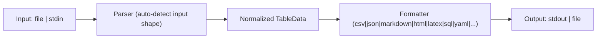

# tablyful

Welcome to the `tablyful` documentation. This project is CLI-first and focuses on converting semi-structured data into common table formats used in data pipelines and reporting.

## What problem does tablyful solve?

`tablyful` solves a simple but common problem: converting semi-structured tabular data into the wide range of textual table formats used in reporting, shell scripts, and data pipelines. Instead of writing ad-hoc scripts to transform JSON into CSV, SQL, Markdown, HTML, LaTeX or YAML, `tablyful` provides a single CLI that understands several JSON shapes and produces consistent, configurable output.

Why CLI-first?

- Shell-friendly: designed to be used in pipelines (`stdin` → `tablyful` → `stdout`) and in scripts.
- Discoverable: small command surface with `--list-set-keys` to explore configurable options.
- Reproducible: project-level `.tablyfulrc.json` files make conversions repeatable across environments.

## Features

`tablyful` is a CLI-first tool focused on fast, predictable conversion of JSON tabular data into common table formats. Key features:

- Multiple input shapes: array of arrays, array of objects, object of arrays, object of objects
- Multiple output formats: csv, tsv, psv, json, markdown, html, latex, sql, yaml
- Unix-friendly CLI: stdin/stdout by default, positional file input supported
- Cascading JSON config (`.tablyfulrc.json`) with repeatable `--set` overrides
- Row filtering with SQL-like predicates (`=`, `!=`, `>`, `<`, `>=`, `<=`, `LIKE`)
- Column projection via `--columns`
- Conversion diagnostics via `--stats`
- Automatic streaming for large JSON arrays when output is one of: csv, tsv, psv, sql, html, yaml
- Discoverability helpers: `--list-set-keys` and `--list-set-keys-format`

## General workflow

## Tech Stack

### Why ReScript?

ReScript offers stronger compile-time guarantees and a terse syntax that compiles to predictable JavaScript. The CLI benefits from:

- Type-safety for the parser/formatter logic (fewer runtime surprises when handling many input shapes).

## How does it compare to alternatives?

- jq: excellent for JSON queries and transformations, but not focused on producing tabular textual formats (csv/markdown/sql) and has a steeper query language for table-style projections.
- csvkit: a mature Python toolkit focused on CSV manipulation; tablyful differs by accepting multiple JSON input shapes and providing many output formats out of the box with streaming.
- Miller (mlr): great for columnar transformations and streaming; tablyful complements it by providing broader output formats (markdown, html, latex, sql) and a JSON-first parsing model.
