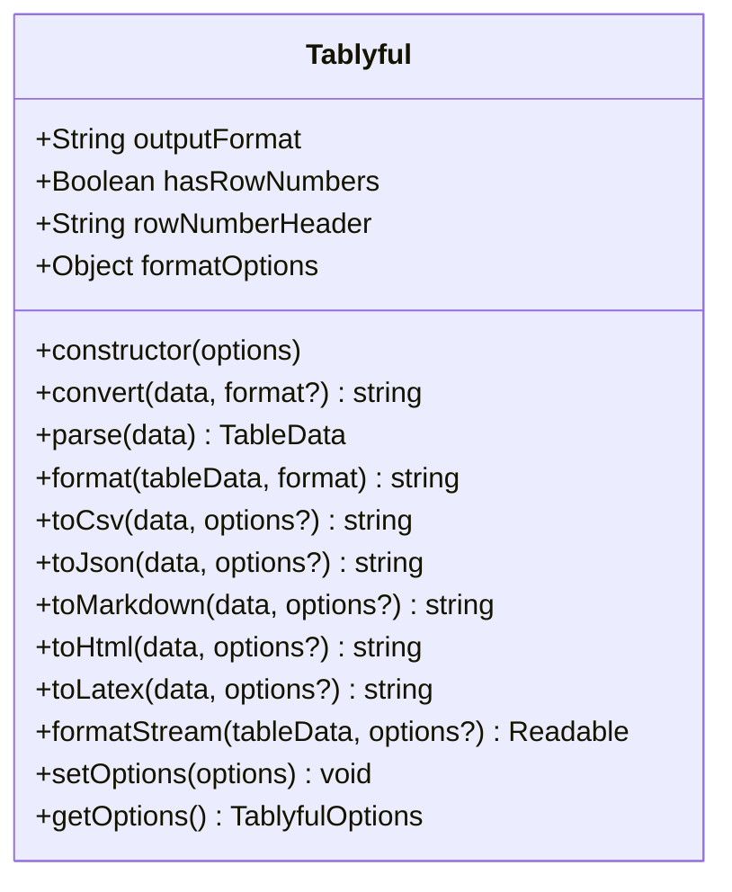

# Advanced API

This page documents advanced usage patterns, streaming capabilities, and low-level APIs for the tablyful library.

---

## Table of Contents

- [Advanced Usage](#advanced-usage)
  - [The Tablyful Class](#the-tablyful-class)
  - [Custom Options](#custom-options)
  - [Data Parsing](#data-parsing)
  - [Custom Headers](#custom-headers)
  - [Row Numbers](#row-numbers)
- [Streaming API](#streaming-api)
  - [When to Use Streaming](#when-to-use-streaming)
  - [Streaming Formatters](#streaming-formatters)
  - [Stream Configuration](#stream-configuration)
  - [Streaming Examples](#streaming-examples)
- [Low-Level APIs](#low-level-apis)
  - [Parser Factory](#parser-factory)
  - [Formatter Factory](#formatter-factory)
  - [Custom Formatters](#custom-formatters)
- [Performance Optimization](#performance-optimization)
  - [Memory Management](#memory-management)
  - [Batch Processing](#batch-processing)
  - [Stream Tuning](#stream-tuning)

---

## Advanced Usage

### The Tablyful Class

For more control over formatting, use the `Tablyful` class instead of the quick functions. The diagram below shows the common public properties and methods available on the `Tablyful` instance.



Public method descriptions (with example options):

- `constructor(options)` — Create a new `Tablyful` instance with optional default options. Accepts global options (e.g., `hasRowNumbers`) and `formatOptions` for format-specific defaults.

Example:

```ts
// Constructor options (TablyfulOptions)
const options = {
  // Input / parsing
  headers: ["name", "age"],
  hasHeaders: true,

  // Row numbers
  hasRowNumbers: true,
  rowNumberHeader: "#",

  // Processing / streaming
  batchSize: 1000,
  maxMemory: 100 * 1024 * 1024, // 100MB
  useStreams: false,
  highWaterMark: 16384,

  // Output
  outputFormat: "markdown",
  formatOptions: {
    // format-specific options (see below)
  },
};

const tablyful = new Tablyful(options);
```

- `convert(data, format?)` — High-level convenience method that parses the input (auto-detecting format) and returns the formatted output string. If `format` is omitted it uses the instance `outputFormat`.

Example:

```ts
// Quick convert with per-call options (QuickFormatOptions)
const csv = tablyful.convert(data, "csv");

// Override options for this call
const csvWithOptions = tablyful.convert(data, "csv", {
  hasRowNumbers: true,
  formatOptions: { delimiter: "," },
});
```

- `parse(data)` — Parse raw input (array/object forms) into the internal `TableData` shape (headers, rows, columns, metadata) without formatting to inspect or manipulate the data.

Example:

```ts
const tableData = tablyful.parse(data);
// Inspect the parsed data
console.log(tableData.headers); // ["name", "age", "city"]
console.log(tableData.rows); // Array of row objects
console.log(tableData.metadata); // Row count, column count, etc.
```

- `format(tableData, format)` — Low-level formatter that takes already-parsed `TableData` and returns a string in the requested `format`. You can pass the same `TablyfulOptions` to control formatting.

Example:

```ts
const csvString = tablyful.format(tableData, "csv", {
  formatOptions: { delimiter: ",", includeHeaders: true },
});
```

- `toCsv/toJson/toMarkdown/toHtml/toLatex` — Convenience helpers equivalent to calling `convert` with the respective format; accept the same options as `convert` (see `QuickFormatOptions`).

```ts
// Quick helpers (QuickFormatOptions) — identical to calling convert(..., "csv")
const csv = tablyful.toCsv(data, { hasRowNumbers: true });
const json = tablyful.toJson(data, { formatOptions: { pretty: true } });
```

- `formatStream(tableData, options?)` — Create a Node.js readable stream from `TableData` for streaming output (useful for large datasets). Supports batching, `highWaterMark`, and format-specific stream options.

```ts
const stream = tablyful.formatStream(tableData, {
  useStreams: true,
  batchSize: 5000,
  highWaterMark: 64 * 1024, // 64KB
  formatOptions: { pretty: true }, // JSON stream pretty printing
});

// Pipe to file or HTTP response
stream.pipe(fs.createWriteStream("output.json"));
```

- `setOptions(options)` — Update instance defaults (merged with existing options).

```ts
tablyful.setOptions({
  hasRowNumbers: true,
  formatOptions: { align: "center" },
});
```

- `getOptions()` — Retrieve the current instance options.

```ts
const current = tablyful.getOptions();
```

---

## Streaming API

### When to Use Streaming

Use streaming when dealing with large datasets (>10,000 rows) to avoid memory issues:

- **Large CSV files** (millions of rows)
- **Big JSON exports** (hundreds of MB)
- **Memory-constrained environments**
- **Real-time data processing**

### Streaming Formatters

Each format has a streaming version:

```ts
import {
  CsvStreamFormatter,
  JsonStreamFormatter,
  HtmlStreamFormatter,
  MarkdownStreamFormatter,
  LatexStreamFormatter,
} from "tablyful";

// Create streaming formatters
const csvStreamer = new CsvStreamFormatter();
const jsonStreamer = new JsonStreamFormatter();
const htmlStreamer = new HtmlStreamFormatter();
const mdStreamer = new MarkdownStreamFormatter();
const latexStreamer = new LatexStreamFormatter();
```

### Stream Configuration

Configure streaming behavior:

```ts
const options = {
  batchSize: 1000, // Process 1000 rows at a time
  highWaterMark: 64, // 64KB buffer
  useStreams: true, // Enable streaming mode
  maxMemory: 50 * 1024 * 1024, // 50MB limit
};
```

### Streaming Examples

#### Basic Streaming

```ts
import { createCsvStreamFormatter } from "tablyful";

const streamer = createCsvStreamFormatter();
const stream = streamer.formatStream(largeData, {
  batchSize: 500,
  formatOptions: { delimiter: ";" },
});

// Pipe to file
stream.pipe(fs.createWriteStream("output.csv"));
```

#### Streaming with Node.js Streams

```ts
import { createMarkdownStreamFormatter } from "tablyful";
import { pipeline } from "node:stream/promises";

const streamer = createMarkdownStreamFormatter();
const stream = streamer.formatStream(data, {
  formatOptions: { align: "center" },
});

// Stream to HTTP response
const server = http.createServer((req, res) => {
  res.setHeader("Content-Type", "text/markdown");
  stream.pipe(res);
});
```

#### Streaming with Transform Streams

```ts
import { createJsonStreamFormatter } from "tablyful";
import { Transform } from "node:stream";

const streamer = createJsonStreamFormatter();
const jsonStream = streamer.formatStream(data, {
  formatOptions: { pretty: true },
});

// Add custom processing
const upperCaseStream = new Transform({
  transform(chunk, encoding, callback) {
    callback(null, chunk.toString().toUpperCase());
  },
});

// Chain streams: JSON -> uppercase -> file
jsonStream.pipe(upperCaseStream).pipe(fs.createWriteStream("output.json"));
```

#### Streaming Large Files

```ts
import { createCsvStreamFormatter } from "tablyful";
import { pipeline } from "node:stream/promises";

const processLargeFile = async () => {
  const streamer = createCsvStreamFormatter();

  // Read from large input file
  const inputStream = fs.createReadStream("large-input.csv");

  // Parse and reformat
  const tableData = await parseCsvStream(inputStream);
  const outputStream = streamer.formatStream(tableData, {
    batchSize: 10_000, // Process in 10k row batches
    formatOptions: { delimiter: "|" },
  });

  // Write to output file
  await pipeline(outputStream, fs.createWriteStream("large-output.csv"));
};
```

---

## Low-Level APIs

### Parser Factory

Create parsers directly for custom workflows:

```ts
import {
  createParser,
  detectParser,
  getAllParsers,
  PARSER_TYPES,
} from "tablyful";

// Create specific parser
const objectParser = createParser(PARSER_TYPES.OBJECT);

// Auto-detect parser
const parser = detectParser(data);
if (parser) {
  const tableData = parser.parse(data);
}

// Get all available parsers
const parsers = getAllParsers();
parsers.forEach((p) => console.log(p.parserName));
```

### Formatter Factory

Create formatters directly:

```ts
import {
  createFormatter,
  getAvailableFormatters,
  isFormatterAvailable,
  FORMATTER_TYPES,
} from "tablyful";

// Create specific formatter
const csvFormatter = createFormatter(FORMATTER_TYPES.CSV);

// Check availability
if (isFormatterAvailable("latex")) {
  const latexFormatter = createFormatter("latex");
}

// List all formats
console.log(getAvailableFormatters()); // ["csv", "json", "html", "markdown", "latex"]
```

### Custom Formatters

Extend base classes for custom formats:

```ts
import { BaseFormatterImpl } from "tablyful";

class CustomFormatter extends BaseFormatterImpl {
  public readonly formatName = "custom";
  public readonly fileExtensions = [".custom"];

  protected _formatData(data: TableData, options?: TablyfulOptions): string {
    // Your custom formatting logic
    return data.rows
      .map((row) => data.headers.map((h) => row[h]).join(" | "))
      .join("\n");
  }
}

// Register and use
const customFormatter = new CustomFormatter();
const result = customFormatter.format(tableData);
```

---

## Performance Optimization

### Memory Management

For large datasets, use streaming and adjust memory settings:

```ts
const options = {
  maxMemory: 100 * 1024 * 1024, // 100MB
  batchSize: 1000, // Process 1000 rows at a time
  useStreams: true, // Enable streaming
};
```

### Batch Processing

Control batch sizes for optimal performance:

```ts
// Small batches for memory-constrained environments
const lowMemoryOptions = {
  batchSize: 100,
  highWaterMark: 16, // 16KB
};

// Large batches for high-performance systems
const highPerformanceOptions = {
  batchSize: 10_000,
  highWaterMark: 1024, // 1MB
};
```

### Stream Tuning

Optimize stream performance:

```ts
const streamOptions = {
  highWaterMark: 64, // Buffer size in KB
  batchSize: 1000, // Rows per batch
  encoding: "utf8", // Character encoding
  objectMode: false, // String mode for text formats
};
```

### Benchmarking

Monitor performance:

```ts
import { performance } from "node:perf_hooks";

const start = performance.now();
const result = toCsv(largeData, { useStreams: true });
const end = performance.now();

console.log(`Processed in ${end - start}ms`);
```

---

## Error Handling

Handle errors gracefully in streaming scenarios:

```ts
import { createCsvStreamFormatter } from "tablyful";

const streamer = createCsvStreamFormatter();
const stream = streamer.formatStream(data);

stream.on("error", (error) => {
  console.error("Streaming error:", error);
  // Handle error appropriately
});

stream.on("end", () => {
  console.log("Streaming completed successfully");
});
```

---

## Best Practices

1. **Use streaming for large datasets** (>10 000 rows)
2. **Set appropriate batch sizes** based on your data size
3. **Configure memory limits** for constrained environments
4. **Handle stream errors** properly
5. **Use the Tablyful class** for complex workflows
6. **Test with representative data** before production use

---

For more examples and advanced patterns, check the examples directory in the repository.
