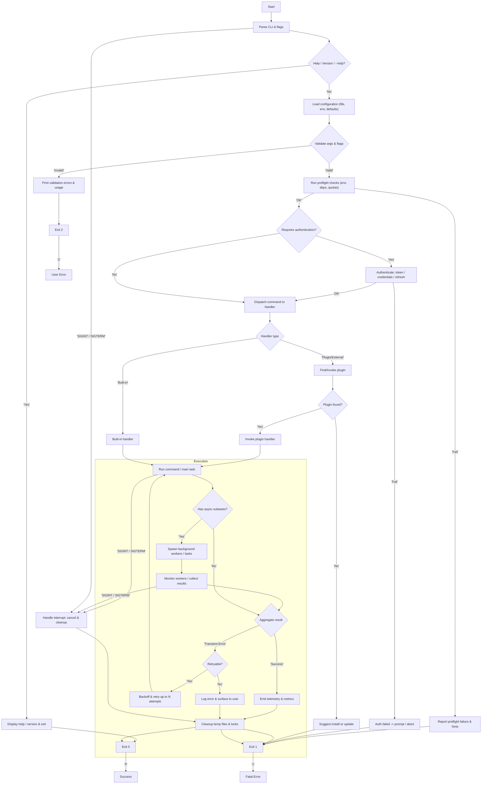

## CLI Control Flow

Detailed medium-level control flow for the CLI including help/version flags, config loading, validation, preflight checks, authentication, command dispatch, execution, retries, signal handling, telemetry, cleanup and exit codes.



<!-- Optional styling snippet (uncomment inside the code block to override theme) -->
```text
%% Optional styling (uncomment to override theme)
%% classDef startEnd fill:#2ecc71,stroke:#27ae60,color:#fff;
%% classDef process fill:#e8f4ff,stroke:#1f78ff;
%% classDef decision fill:#fffbe6,stroke:#f39c12;
%% classDef io fill:#f7f7f7,stroke:#7f8c8d;
%% classDef error fill:#ffe6e6,stroke:#c0392b;
%% class Start,Exit0,Exit1,Exit2 startEnd;
%% class ParseCLI,LoadConfig,Preflight,Auth,Dispatch,BuiltIn,External,Run,Spawn,Monitor,Cleanup,EmitTelemetry process;
%% class CheckHelp,ValidateArgs,AuthNeeded,CommandType,RunAsync,Retry,PluginFound decision;
%% class ShowHelp,ValidateFail,PreflightFail,AuthFail,FatalError,PluginNotFound io;
%% class SignalHandler error;
```
